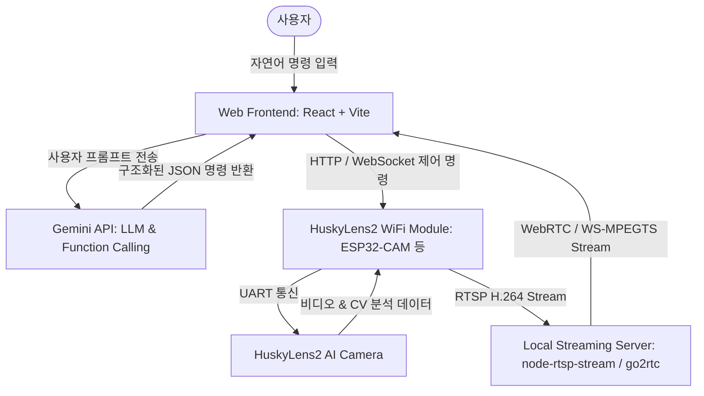

# Product Requirement Document (PRD)

## 1. 프로젝트 개요 (Overview)
* **프로젝트명**: HuskyVision AI Link (허스키렌즈2 AI 자연어 제어 및 실시간 무선 스트리밍 웹 앱)
* **목적**: WiFi 모듈이 탑재된 허스키렌즈2(HuskyLens 2)와 Gemini LLM을 연동하여, 동일 네트워크상에서 사용자가 자연어로 카메라를 제어하고, 허스키렌즈의 딥러닝 비전 분석(CV) 화면을 실시간 무선 RTSP 스트리밍으로 웹브라우저에서 확인하는 프리미엄 제어 스테이션 구축.
* **대상 사용자**: 스마트 홈/로봇 공학 개발자, 딥러닝 비전 기술 연구원 및 취미 공학자.

---

## 2. 핵심 기능 요구사항 (Key Features)

### F-1. 로컬 네트워크 기반 자동 장치 탐색 및 연결
* **동일 WiFi 망 연동**: 노트북(웹 앱 구동부)과 허스키렌즈2(WiFi 모듈 탑재부)가 동일한 무선 AP(WiFi)에 연결되어 있을 때 상호 연동 가능해야 함.
* **장치 탐색 및 상태 모니터링**: 웹 앱 대시보드에서 허스키렌즈2의 IP 주소를 입력하거나 로컬 네트워크 스캔(MDNS 등)을 통해 장치에 연결하고 연결 상태(Ping, 신호 세기, 현재 배터리/전원 상태 등)를 모니터링.

### F-2. Gemini LLM 기반 자연어 제어 (Natural Language Control)
* **자연어 명령 해석**: 사용자의 한국어/영어 음성 또는 텍스트 입력(예: *"문 앞에 오는 사람 얼굴 좀 인식해봐"*, *"빨간색 공 추적 모드로 변경해줘"*, *"핸드 트래킹 시작해"*)을 Gemini API가 수신.
* **Function Calling을 통한 하드웨어 제어**: Gemini 모델이 사용자의 자연어를 분석하여 허스키렌즈2의 7가지 핵심 CV 알고리즘 작동 코드 및 파라미터로 변환.
  * **대상 CV 모드**: 안면 인식(Face Recognition), 객체 인식(Object Recognition), 감정 인식(Face Expression), 객체 추적(Object Tracking), 라인 트래킹(Line Tracking), 컬러 인식(Color Recognition), 태그 인식(Tag Recognition) 등.
* **명령 전송 체계**: 변환된 API 명령어(HTTP REST API 혹은 WebSocket 패킷)를 허스키렌즈2 WiFi 모듈로 전송하여 실시간 하드웨어 모드 스위칭 실행.

### F-3. RTSP 무선 실시간 스트리밍 (RTSP Wireless Streaming to Web)
* **RTSP 영상 수신**: 허스키렌즈2 WiFi 모듈에서 무선 송출하는 RTSP 스트림 수신.
* **웹 호환 변환**: 브라우저 표준 `<video>` 태그에서 재생이 불가능한 RTSP 프로토콜을 웹 친화적인 **WebRTC** 또는 **MSE (Media Source Extensions, FLV/MPEG-TS over WebSocket)** 포맷으로 실시간 트랜스코딩하여 전송.
* **초저지연(Ultra-Low Latency) 스트리밍**: 제어 명령과 화면 간의 괴리감을 최소화하기 위해 스트리밍 지연 속도(Latency)를 **0.5초 이내**로 유지.
* **CV 분석 메타데이터 오버레이**: 허스키렌즈가 분석하여 JSON으로 반환하는 바운딩 박스(Bounding Box), 라벨 정보, 좌표 데이터를 실시간 스트리밍 비디오 캔버스 위에 매끄러운 2D CSS/Canvas 오버레이 애니메이션으로 렌더링.

---

## 3. 비기능적 요구사항 (Non-Functional Requirements)

### N-1. 성능 및 지연율 (Performance & Latency)
* **RTSP 디코딩 및 전송**: 로컬 Node.js 중계 서버(또는 프록시)를 통해 WebRTC/WebSocket으로 전환 시 오버헤드를 최소화하고 지연을 극대화하여 억제.
* **Gemini LLM 반응 속도**: 명령어 해석 및 실행 응답 속도는 1.5초 이내를 목표로 함.

### N-2. 사용자 경험 및 비주얼 디자인 (Premium UI/UX)
* **어두운 슬레이트(Slate) 테마 및 다크 모드**: 미래 지향적 스마트 제어 스테이션 느낌의 프리미엄 슬레이트 다크 모드.
* **글래스모피즘(Glassmorphism) 효과**: 투명한 반투명 컨트롤러 카드 패널, 블러 백그라운드 효과.
* **실시간 인터랙티브 UI**: 허스키렌즈2와의 연결 여부에 따라 빛나는 맥동(Pulsing) LED 상태 인디케이터, 미세한 호버/클릭 마이크로 애니메이션 제공.

---

## 4. 아키텍처 및 기술 스택 (Technical Stack)

* **Frontend**: React + Vite (TypeScript), Tailwind CSS (Harmonic Dark Mode, Glassmorphism)
* **LLM Engine**: Google Gemini (VITE_GEMINI_API_KEY 로딩 및 클라이언트 사이드 연동 또는 Node API 중계)
* **Streaming Server / Gateway**:
  * Option A: `go2rtc` (초저지연 WebRTC/RTSP 게이트웨이, 추천)
  * Option B: `node-rtsp-stream` (RTSP -> WebSocket MPEG1 트랜스코더 + jsmpeg.js)
* **HuskyLens 2 WiFi Controller**: ESP32 또는 WiFi 모듈상에서 실행되는 소형 웹서버 (REST API 및 RTSP Stream Server).

---

## 5. 단계별 마일스톤 (Milestones)

1. **Phase 1**: 로컬 개발 환경 구성, RTSP 중계 게이트웨이 셋업 및 기본 카메라 화면 스트리밍 웹 연동 (RTSP to Web).
2. **Phase 2**: Gemini API 및 Function Calling 연동, 자연어로 들어오는 인풋을 허스키렌즈2 API 명령어로 매핑하는 백엔드 로직 설계.
3. **Phase 3**: 웹 컨트롤 패널 프론트엔드 제작 (Slate 다크 모드, 글래스모피즘, 실시간 제어 바운딩 박스 캔버스 렌더링).
4. **Phase 4**: 동일 WiFi 대역 내에서의 E2E 장치 제어 및 무선 스트리밍 종합 검증, 예외 처리 고도화.
